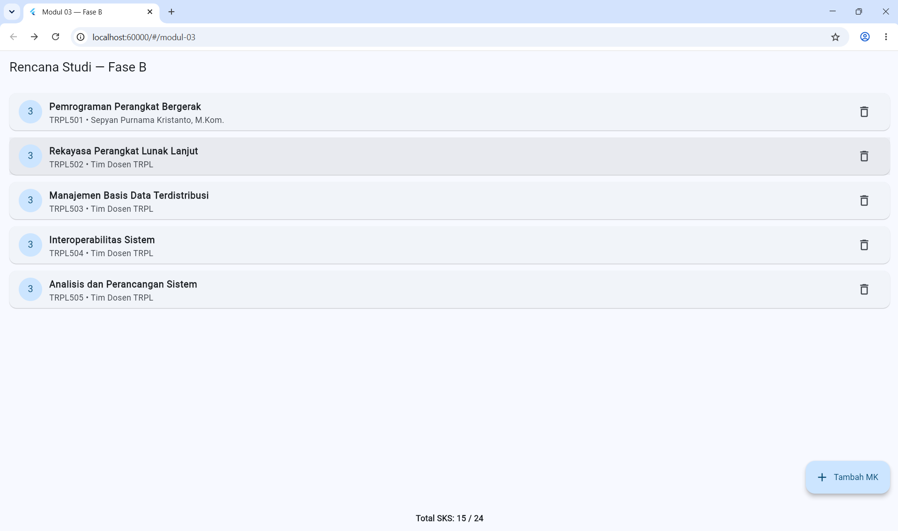
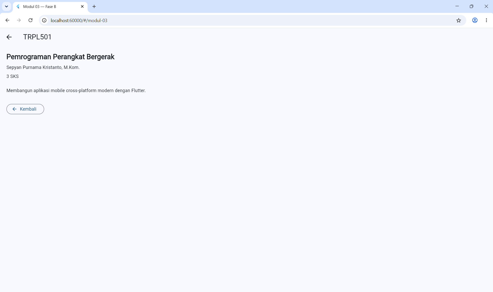
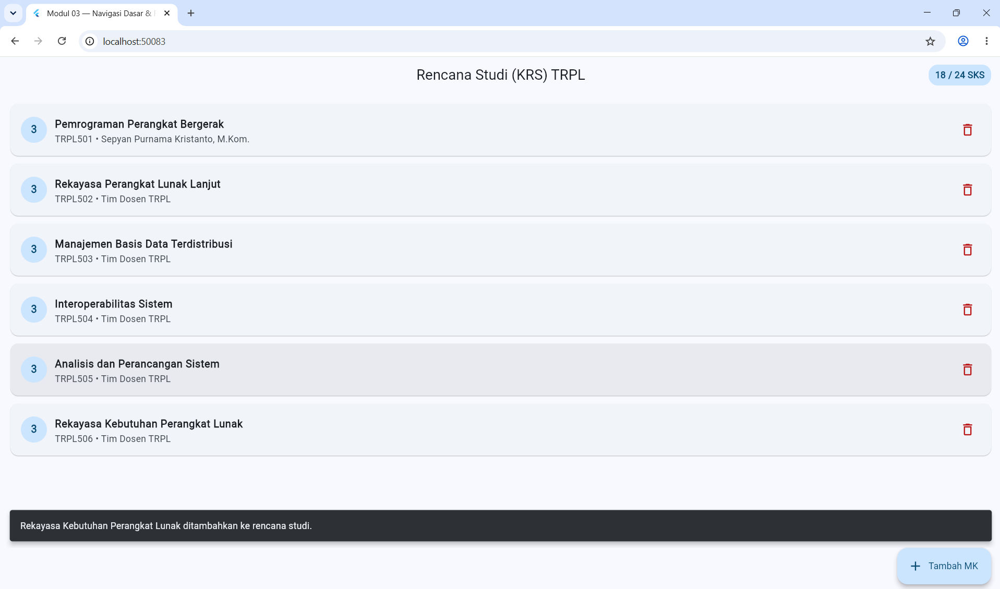
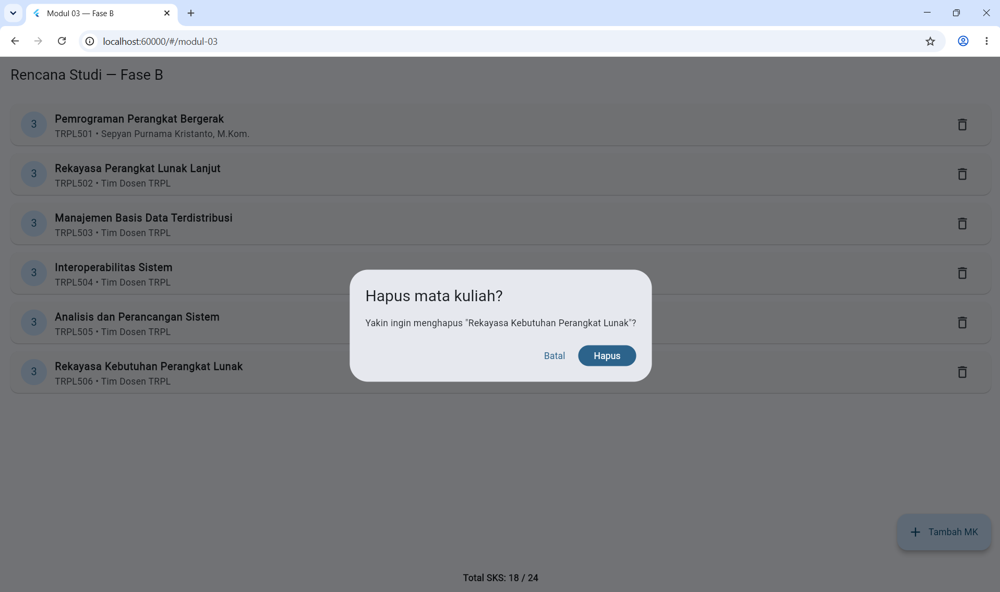

# Modul 03 - Navigation & State Management

- **Nama:** Bunga Hendryanda Ramadhani
- **NIM:** 362558302031
- **Kelas:** 2CTRPL
- **Prodi:** Sarjana Terapan TRPL
- **Mata Kuliah:** Pemrograman Perangkat Bergerak

---

## 1. Deskripsi

Pada Modul 03 saya membuat aplikasi KRS sederhana menggunakan Flutter.

Modul ini dikerjakan dalam dua fase.

**Fase A** menggunakan navigasi dasar Flutter seperti `Navigator.push()` dan
`Navigator.pop()`, serta state lokal menggunakan `setState()`.

**Fase B** menggunakan `GoRouter` untuk navigasi dan `Riverpod Notifier`
untuk mengelola state secara terpisah dari widget.

---

## 2. Fitur Fase A

- Menampilkan minimal 5 mata kuliah.
- Menampilkan total SKS.
- Membuka detail mata kuliah.
- Menambahkan mata kuliah melalui form.
- Validasi input form.
- Menolak kode mata kuliah duplikat.
- Menolak total SKS lebih dari 24.
- Menghapus mata kuliah dengan dialog konfirmasi.
- Menampilkan empty state jika daftar kosong.

---

## 3. Fitur Fase B

- Menggunakan `GoRouter`.
- Menggunakan `Riverpod Notifier`.
- State KRS dipindahkan dari widget ke provider.
- Navigasi menggunakan route yang terdefinisi.
- Detail mata kuliah dapat dibuka berdasarkan kode.
- Mendukung deep link seperti:

---

## 4. Bukti Screenshot

### 4.1 Daftar KRS

Menampilkan daftar mata kuliah dan total SKS yang sedang diambil.

### 4.2 Detail Mata Kuliah

Menampilkan detail mata kuliah berupa kode, nama mata kuliah, dosen, SKS,
dan deskripsi.

### 4.3 Form dengan Validasi

Menampilkan form tambah mata kuliah saat tombol simpan ditekan dalam keadaan
field masih kosong sehingga pesan validasi muncul.

### 4.4 Dialog Konfirmasi Hapus

Menampilkan dialog konfirmasi sebelum mata kuliah dihapus dari daftar.

---

## 5. Perbedaan Fase A dan Fase B

| Bagian | Fase A | Fase B |
|---|---|---|
| State | `_KrsListScreenState` | `KrsNotifier` |
| Navigasi | `Navigator.push()` dan `Navigator.pop()` | `GoRouter` |
| Pengiriman data detail | Objek melalui constructor | Kode melalui route |
| Perubahan state | `setState()` | Provider menghasilkan state baru |
| Penyimpanan state | Di dalam widget | Di luar widget |
| Deep link | Tidak tersedia | Tersedia melalui route |

Pada Fase A, navigasi dan state masih dikelola langsung oleh widget sehingga
lebih sederhana untuk aplikasi dengan beberapa layar.

Pada Fase B, navigasi menggunakan `GoRouter` dan state dipindahkan ke
`Riverpod Notifier`. Cara ini membuat struktur aplikasi lebih terpisah dan
lebih mudah dikembangkan ketika jumlah route dan state bertambah.

---

## 6. Refleksi

### 6.1 State di Widget dan Provider

Menurut saya, state yang dipindahkan ke `KrsNotifier` menjadi lebih mudah
digunakan kembali karena tidak bergantung pada satu widget. Logika seperti
menambah, menghapus, dan menghitung SKS juga menjadi lebih terpisah dari
tampilan. Kekurangannya, jumlah file dan kode menjadi lebih banyak serta
perlu memahami cara kerja Riverpod.

### 6.2 Detail Menjadi StatefulWidget

Pada kondisi awal, layar detail hanya menampilkan data sehingga tidak perlu
menyimpan state. Pada Latihan 1, layar detail harus memperbarui nilai SKS.
Karena ada perubahan data yang harus ditampilkan kembali, layar detail perlu
menyimpan state sehingga menggunakan `StatefulWidget`.

### 6.3 GoRouter dan Riverpod untuk Aplikasi Tiga Layar

Menurut saya, jika aplikasi hanya memiliki tiga layar, penggunaan
`Navigator` dan state lokal masih lebih sederhana dan lebih mudah dipahami.
GoRouter dan Riverpod lebih terasa manfaatnya ketika aplikasi memiliki lebih
banyak route dan state yang digunakan oleh beberapa bagian aplikasi.

### 6.4 List `const` dan Flutter Analyze

Masalah list `const` dapat lolos dari `flutter analyze` karena kode tersebut
secara struktur masih valid. Kesalahan baru terlihat saat aplikasi mencoba
melakukan operasi seperti `add()` atau `removeWhere()` pada list yang tidak
dapat diubah. Salah satu cara mencegahnya adalah membuat test yang menguji
langsung proses tambah dan hapus data.

---

## 7. Penggunaan AI

Dalam pengerjaan Modul 03 saya menggunakan ChatGPT sebagai alat bantu untuk
memahami materi, menyusun kode, dan mencari penyebab error yang ditemukan
selama pengerjaan.

AI digunakan sebagai alat bantu dalam memahami penggunaan `Navigator`,
`setState()`, `GoRouter`, `Riverpod Notifier`, validasi form, dan struktur
aplikasi.

Kode yang digunakan tetap saya periksa, sesuaikan dengan materi Modul 03,
dan saya uji sendiri menggunakan `flutter analyze`, `flutter test`, serta
menjalankan aplikasi secara langsung.